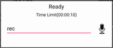
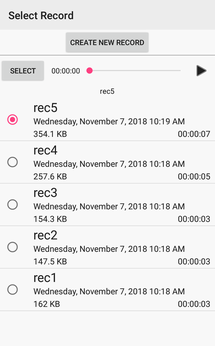

# Android Recorder
<a target="_blank" href="https://developer.android.com/reference/android/os/Build.VERSION_CODES.html#ICE_CREAM_SANDWICH"></a>

## Overview
Recorder library for android.

## Installation

### Gradle
1. Add repository url to build.gradle(Project)
```groovy
allprojects {
    repositories {
        ...
        maven {
            ...
            url 'https://www.myget.org/F/tkpphr-android-feed/maven/'
        }
    }
}
```

2. Add dependency to build.gradle(Module)
```groovy
dependencies {
    ...
    implementation 'com.tkpphr.android:recorder:1.0.0'
    implementation 'com.android.support:appcompat-v7:27.1.1'
}
```

or

### Maven
```xml
...
<repositories>
  ...
  <repository>
    <id>tkpphr-android-feed</id>
    <url>https://www.myget.org/F/tkpphr-android-feed/maven/</url>
  </repository>
</repositories>
...
<dependencies>
  ...
  <dependency>
    <groupId>com.tkpphr.android</groupId>
    <artifactId>recorder</artifactId>
    <version>1.0.0</version>
    <type>aar</type>
  </dependency>
  <dependency>
    <groupId>com.android.support</groupId>
    <artifactId>appcompat-v7</artifactId>
    <version>27.1.1</version>
    <type>aar</type>
  </dependency>
</dependencies>
...
```

## Usage

### Sound

Required permmissions["android.permission.READ_EXTERNAL_STORAGE", "android.permission.WRITE_EXTERNAL_STORAGE","android.permission.RECORD_AUDIO"]

#### Record
1. Import class
```java
import com.tkpphr.android.recorder.view.dialog.SoundRecorderDialog;
```

2. Implement "com.tkpphr.android.recorder.view.OnSoundRecordListener" to activity or fragment.
```java
@Override
public void onRecordStart() {

}

@Override
public void onRecordStop(File outputFile) {
	
}
```

3. Open dialog
```
SoundRecorderDialog.newInstance(saveDirectory:File,maxDurationInMilliseconds:long).show(fragmentManager,tag);
```



#### Record and Select
1. Add manifest
```xml
<activity android:name="com.tkpphr.android.recorder.view.activity.SelectSoundRecordActivity"/>
```

2. Import class
```java
import com.tkpphr.android.recorder.view.activity.SelectSoundRecordActivity;
```

3. Start activity
```java
Intent intent=SelectSoundRecordActivity.createIntent(context, title:String,saveDirectory:File,maxDurationInMilliseconds:long);
startActivityForResult(intent,recordRequestCode);
```



4. Get result
```java
@Override
protected void onActivityResult(int requestCode, int resultCode, Intent data) {
  super.onActivityResult(requestCode, resultCode, data);
  if(resultCode==RESULT_OK && requestCode==recordRequestCode){
    String filePath=SelectSoundRecordActivity.getSelectedFilePath(data);
  }
}
```

## License
Released under the Apache 2.0 License.
See LICENSE File.